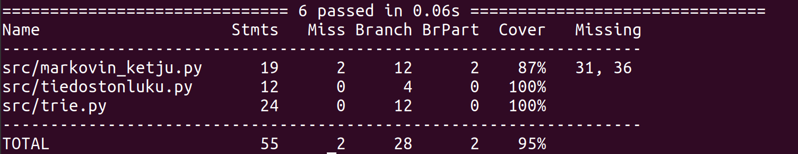

# Testausraportti

## Yksikkötestaus
## Kattavuusraportti

 
Yksikkötestit voi suorittaa komennolla:   
> poetry run invoke test
 
Testikattavuuden näkee myös komennolla:  
> poetry run invoke coverage-report
 
Yksikkötestauksessa on testattu trien osalta 2. asteen Markovin ketjua varten
kaaren lisäys, oikeiden avainten ja arvojen tallentuminen sekä 3. asteen ketjua
varten avainten tallentuminen. Markovin ketjun toimintaa testataan vain tarkistamalla, tuleeko ennustuksesta halutun pituinen. Koska ketjun toiminta
perustuu satunnaisuuteen, sen toimintaa on hankala yksikkötestata. Lisäksi testataan tiedoston lukeminen ja siitä listan muodostaminen oikein.
 

## Ohjelman tuotosten testaus ja arviointi

Ohjelman tuotoksia on tarkasteltu eri Markovin ketjun asteilla ja
horoskooppeja käyttäen. 
 
 
**Testi 1**
 
 
Käytetyt syötteet:
 
Horoskooppi: Kaksonen  
Pituus: 5 virkettä  
Ketjun aste: 1  
 
Tulos:  
"KAKSONEN Valikoi sanasi huolella.
Käänteet voivat tulla nyt paras tapa saada omituisia sävyjä.
Älä usko kaikkea itseäsi ja palauttaa mieleesi tärkeimmät elementit,
 mitä muut tekevät ihmeitä. 
Älä usko kaikkea, niin.
Pidä huoli itsestäsi." 
 
 
Havainnot: Vain pieni osa virkkeistä ovat järkeviä. Kun virkkeen pituuden kasvaessa niiden järjettömyys lisääntyy.
Ainoastaan ensimmäinen ja viimeinen virke esiintyvät aineistossa samanlaisina. 
 
 
**Testi 2**
 
 
Käytetyt syötteet:
 
Horoskooppi: Vaaka  
Pituus: 5 virkettä  
Ketjun aste: 2  
 
Tulos:  
VAAKA Keskity hyvinvointiin, terveyteen ja tärkeisiin läheisiin. 
Järkiperäiset päätökset kannattavat pidemmän päälle kuormittaviksi.
 Luova puolesi on nyt vaihtoehtoja, joista valita. 
Kaikki ei nyt ole sitä, miltä näyttää. 
Priorisoi tavoitteesi ja suuntaa huomiosi muualle. 
 
 
Havainnot:  
Virkkeet ovat huomattavasti järkevämpiä verrattuna ensimmäiseen asteeseen. Silti epämääräisyyttä on jäljellä. 
Ensimmäinen ja kolmas virke löytyy aineistosta samanlaisina, muissa on jonkin verran eroa aineistoon. 
 
 
**Testi 3**
 
 
Käytetyt syötteet:
 
Horoskooppi: Vesimies  
Pituus: 5 virkettä  
Ketjun aste: 3  
 
Tulos:  
"VESIMIES Satsaa terveellisiin elämäntapoihin ja hyvinvointiin. 
Yksinkertaiset kikat toimivat parhaiten.
 Päivä tarjoaa sinulle paljon hyödyllistä tietoa tulevasta.
 Pärjäile rahkeilla, mitä sinulla nyt on ja harkitse rauhassa, mitä oikein lähtisit tavoittelemaan. 
Alkuviikolla voi aueta tilaisuus ansaita vähän ylimääräistä ja yhteistyön mahdollisuus voi yllättää sinut.
 
 
Havainnot:  
Jokainen virke on järkevä ja ymmärrettävää suomen kieltä. 
Ensimmäinen ja toinen virke löytyvät aineistosta peräkkäin samanlaisina,
kolmas virke löytyy samanlaisena yksinään sekä neljäs ja viides virke myös vierekkäin. 
 

**Johtopäätös:**
 
Ennustuksista tulee "omaperäisempiä" ensimmäisillä Markovin ketjun asteilla.
Toisaalta tällöin lauseet eivät aina ole järkeviä. Asteen kasvaessa järkevyys lisääntyy,
mutta ne alkavat muistuttaa enemmän aineistossa esiintyviä lauseita.
