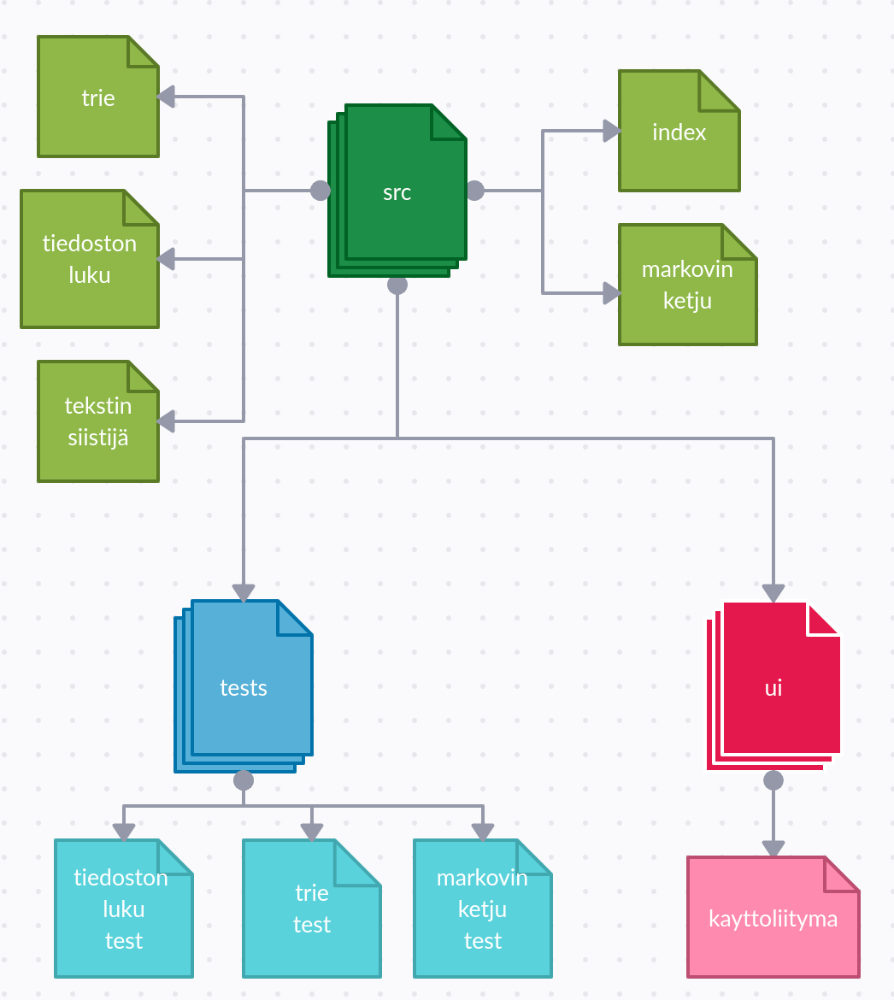

# Toteutusdokumentti

## Yleisrakenne:

SRC-hakemisto sisältää ohjelmassa käytettävät tietorakenteet sekä algoritmit eli trien ja Markovin ketjun toteutukset. 
Hakemistossa on myös tiedoston lukija, tekstin siistijä sekä index.py, joka käynnistää ohjelman. 
Käyttöliittymä on sijoitettu src:n "ui"-kansioon. Src:n toinen kansio, "tests", sisältää ohjelman testit. 

## Aika- ja tilavaativuus:

Aluksi ohjelma lukee opetusdatatiedoston ja muodostaa siinä esiintyvistä sanoista listan. Tämän operaation
aikavaativuus on O(n), missä n on tiedostossa olevien sanojen määrä.
Tämän listan perusteella ohjelma rakentaa Trien. Listan jokainen sana käydään kerran läpi ja jokaisella kerralla
tarvitaan tietoa m-1 verran seuraavista sanoista, kun m on käytettävän Markovin ketjun aste. Trien luomiseen
kuluu siis aikaa O(nm). Trien luonnissa käytetään apulistaa, joka pitää kirjaa seuraavista sanoista, minkä takia 
sen tilavaativuus on O(m). Yksittäisen kaaren lisäämisen aikavaativuus on O(1), koska trien toteutukseen käytetään sanakirjaa.
Ennustuksen generoimiseen käytetään Markovin ketjua, joka on toteutettu rekursiivisesti. Yksittäisen rekursiokutsun aikavaativuus
riippuu seuraavaksi sanaksi valittavien vaihtoehtojen määrää eli O(k). Kokonaisen generoimiseen kuluu O(k^l), kun l on rekursiokutsujen määrä.
Rekursiokutsujen määrää ei tiedetä etukäteen, koska niiden määrä riippuu siitä, kuinka nopeasti ohjelma sattuu arpomaan oikean pituisen ennustuksen.
Ennustuksen generointia varten käytetään apulistaa, johon kerätään valittavissa olevat seuraavat sanat, jolloin tilavaativuus on O(kl). 
Lopuksi generoitu ennustus siistitään listasta luettavampaan muotoon, mihin kuluu O(x) aika, kun x on listan pituus.
Kokonaisaikavaativuus on siis O(k^l) ja tilavaativuus O(kl).

## Puutteet ja parannukset:

Ketjun asteen kasvaessa, muodostuvista lauseista tulee hyvin samanlaisia kuin
lähdeaineistossa. Lisäämällä lähdeaineistoa eli "opetusdataa" ohjelmalle, tätä
voitaisiin ehkäistä.

## Lähteet:

https://en.wikipedia.org/wiki/Trie
 
https://en.wikipedia.org/wiki/Markov_chain
 
https://medium.com/analytics-vidhya/making-a-text-generator-using-markov-chains-e17a67225d10
 
https://ohjelmistotekniikka-hy.github.io/materiaali
 
Antti Laaksonen - Tietorakenteet ja algoritmit-kirja (2021)
 
https://www.is.fi/menaiset/horoskooppi/

